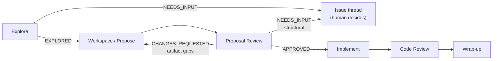
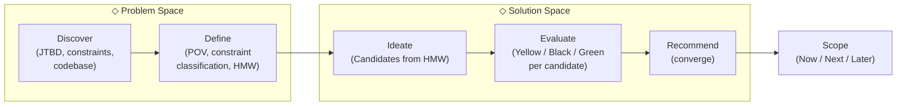
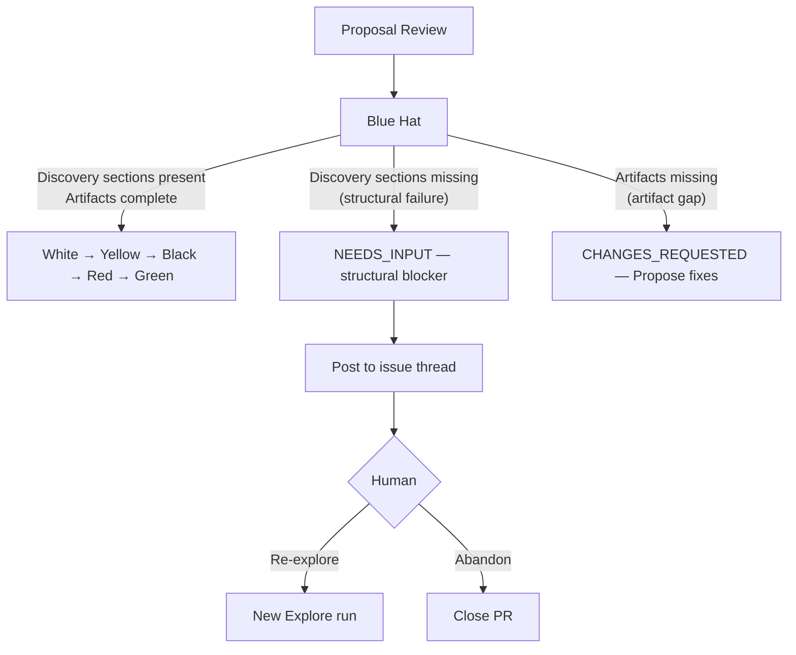

## Architecture and Flow

### Pipeline stages

### Double Diamond

### Blue Hat routing

---

## Context

The openspec-auto pipeline uses prompt files in `skill/openspec-auto/prompts/` to define each sub-agent's behavior. The explore sub-agent (`explore.md`) is the first stage that does substantive product work: it reads the issue, investigates the codebase, and produces a discovery output that flows to the propose stage. The proposal-review sub-agent (`proposal-review.md`) independently checks whether the proposal is sound before implementation begins.

The failure in skillet-cli#120 demonstrated that explore was optimizing for "understand what the issue asks for" rather than "understand the real problem and find the best solution." The root cause is structural: the current flow (Classify → Investigate → Synthesize) has only one diamond. It lacks a dedicated problem-framing step (Define) and a generative solution step (Ideate). Without these, the agent defaults to treating the issue's suggested approach as the answer, doing no comparative evaluation.

Issue #17 proposed additive patches: add a "Problem diagnosis" section, add "Solutions considered," tighten NEEDS_INPUT criteria. This design takes a different approach: restructure around the Double Diamond, use product vocabulary throughout, and extend proposal-review with Six Thinking Hats.

Current explore output sections: Problem · Classification · Findings · Approach · Out of scope

New explore output sections: Point of View · How Might We · Constraints · Candidates · Recommendation · Now / Next / Later

## Goals / Non-Goals

**Goals:**
- Explore follows the Double Diamond: two explicit diamonds (Problem Space → Solution Space) with named steps at each phase
- Product vocabulary is used throughout — POV, JTBD, HMW, Candidates, Recommendation — because vocabulary influences thinking and product vocabulary induces product thinking
- JTBD is extracted for every feature issue, not conditionally — "the job is obvious" is a fallacy
- Candidates are generated from the HMW (the problem), not from the issue text; the issue's implied approach is not a mandatory candidate
- Six Thinking Hats applied at two levels: Yellow/Black/Green per candidate in explore's Evaluate step; all six hats across the full proposal in proposal-review
- Now/Next/Later replaces the "Out of scope" list — quality is fixed, scope is negotiated via active sequencing decisions
- NEEDS_INPUT rate stays low; diverging from the issue's framing is a product decision the agent makes autonomously

**Non-Goals:**
- Changing the pipeline stage structure (explore → propose → proposal-review → implement → code-review)
- Changing how the orchestrator dispatches sub-agents
- Runtime code changes — all changes are to agent prompt files
- Encoding exhaustive product judgment that requires domain context the agent can't have

## Decisions

### 1. Full Double Diamond restructure, not additive patches

**Decision:** Restructure explore.md around the Double Diamond, not patch new sections onto the existing structure.

The existing structure (Investigate → Synthesize) implicitly treats the issue as a specification. Adding "Problem diagnosis" and "Solutions considered" sections on top of that structure leaves the original frame intact — the agent still starts from the issue's framing and adds analytical sections to it. The Double Diamond restructure changes the mental model: the agent starts from the user problem (first diamond) before entering the solution space (second diamond). The framework itself prevents starting from the issue's solution.

### 2. Product vocabulary as first-class, not optional

**Decision:** Rename all output sections to use product development terms. No compatibility aliases.

Vocabulary influences thinking. "Problem" → "Point of View" forces solution-neutral problem framing. "Approach" → "Recommendation" signals a deliberate choice, not a derived output. "Solutions considered" → "Candidates" emphasizes they were generated from the problem, not from the issue. "Out of scope" → "Now/Next/Later" turns a passive list into an active sequencing decision. The rename is intentional friction — it forces the agent out of issue-processing mode.

### 3. JTBD required for every feature, unconditionally

**Decision:** JTBD extraction is a required step in Discover for every feature issue, not gated on "if the job is unclear."

"The job is obvious" is the fallacy that produces the PR #120 failure mode. The job-to-be-done of "help users expand a published skillet's scope" is obvious in hindsight — but the explore agent accepted the issue's stated solution ("document npm commands") without ever writing out what the user was actually trying to accomplish. Writing the JTBD statement is a forcing function: if the job is truly obvious, it takes one sentence; if it isn't, writing it surfaces the gap.

### 4. Issue-implied approach is not a required candidate

**Decision:** Candidates are derived from the HMW (the problem), not anchored to the issue's implied solution. The issue's suggested approach is one signal, not a required list entry.

Requiring the issue's implied approach as a mandatory candidate makes solution generation solution-first. The agent starts from the issue's solution and asks "what else?" — that's still the same mistake, just slightly less constrained. The right behavior: define the problem, write the HMW, generate candidates from the HMW. If the issue's suggestion is a good candidate, it will appear naturally. If the recommendation diverges from the issue's implied approach, one sentence of acknowledgment is sufficient ("the issue suggested X; this was not carried forward because Y").

### 5. Six Thinking Hats at two levels

**Decision:** Apply a subset of Six Thinking Hats during Evaluate in explore (Yellow/Black/Green per candidate), and all six hats across the full proposal in proposal-review.

Splitting them this way avoids redundancy: explore's evaluation is candidate-level (which option is better?); proposal-review's evaluation is proposal-level (is the overall product judgment sound?). The Red Hat, which doesn't translate to AI intuition, is reframed in proposal-review as stakeholder hat-wearing — the reviewer takes the perspective of a product developer, a PM, and a UX researcher to perform a perspective check on the overall coherence of the proposal.

### 6. Now/Next/Later replaces Out of scope

### 7. Candidates apply to all issue types, not only features

**Decision:** Remove the "For feature issues" qualifier from the Candidates requirement. Bug issues also enumerate at least two candidates, with "won't fix" and "fix as reported" always enumerated.

Bugs routinely have multiple valid resolution paths: fix the reported behavior, won't fix (with documented reasoning), fix in documentation, degrade gracefully with a better error. Restricting candidates to features means the agent produces a single assumed fix for bugs — the same failure mode as #120 (no comparative evaluation) reproduced for a different issue class. Making candidates universal also eliminates the formal contradiction in the Recommendation requirement, which refers to "the chosen candidate" without a feature qualifier.

**Decision:** The final output section is a Now/Next/Later scope breakdown, not an "Out of scope" list.

"Out of scope" is passive — it lists things the change won't do. "Now/Next/Later" is active — it sequences what goes in this PR, what becomes a clear follow-up, and what is future direction without commitment. This aligns with the VISION.md principle of "loop quality over throughput": MVP is the smallest set that solves the core problem well, not the minimum that satisfies the literal issue. Large scope → sequencing proposal, not scope-cutting.

## Alternatives Considered

### Fix the opsx:explore skill rather than explore.md

The current explore.md delegates investigation to the `opsx:explore` skill. The fix could live in the skill rather than the pipeline prompt. *Rejected because:* the failure in #120 was behavioral — the explore stage accepted a constraint without evaluating it. That is a problem with what the pipeline instructed explore to do during investigation, not with the skill's investigation stance. Fixing the skill would improve investigation breadth but would not introduce constraint classification, JTBD extraction, or comparative candidate generation. The pipeline prompt must own the product-evaluation discipline; the skill provides the investigation posture underneath it.

### Fix only proposal-review (downstream gate)

Add a criterion to proposal-review: "did explore evaluate at least two approaches?" without touching explore.md. *Rejected because:* a downstream gate that catches a bad explore output does not fix explore producing it. The agent still starts from the issue's framing, accepts constraints without evaluation, and derives a single approach — proposal-review catches and rejects it, creating a rejection-rerun loop rather than producing better output. Fixing the source is correct.

---

## Risks / Trade-offs

- **Longer explore outputs** → larger context passed to propose. Acceptable; propose already handles substantial discovery context.
- **Red Hat requires careful framing** → anthropomorphizing AI evaluation risks generating generic "feelings" prose. Mitigated by framing as explicit stakeholder personas (product developer, PM, UX researcher, gut coherence) rather than emotions or intuition.
- **propose.md references old section names** → the propose prompt currently says "its Problem and Findings drive the proposal's why, its Approach drives the design decisions." After this change, those section names no longer exist. This is a known downstream impact; it needs a follow-up update to propose.md to reference "Point of View" and "Recommendation." Not in scope here — tracked in Now/Next/Later.
- **HMW quality variance** → a poorly-formed HMW (too narrow or too broad) will produce poor candidates. Proposal-review's Blue Hat check gives a correction loop, but it adds a cycle. Mitigated by including HMW formulation rules in explore.md (must not embed a solution, must be specific enough to be relevant).
- **No executable test harness for prompt changes** → TDD as defined in VISION.md requires a red/green cycle; the spec scenarios are human-readable GWT assertions with no test runner or evaluation harness. This is an accepted constraint for this change. The spec scenarios serve as design documentation and reviewer checklists; verification is by inspection until an evaluation harness exists.
