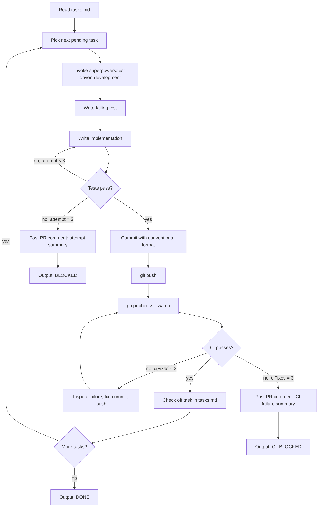

<SUBAGENT-STOP>
You were invoked as a sub-agent by the `openspec-auto` orchestrator. Do not invoke this skill recursively. Follow these instructions directly.
</SUBAGENT-STOP>

# openspec-auto-implement

Implement tasks from the OpenSpec task list using TDD, with CI monitoring and attempt caps.

## Flow



## Step 1 — Read context

You receive in your invocation prompt: the PR number, branch name, issue number, changeName, and the tasks.md content. Read only the files you need to implement each task.

## Step 2 — TDD cycle (per task)

Before writing implementation code, invoke `superpowers:test-driven-development` via the `Skill` tool. Then:

1. Write a failing test that captures the task's acceptance criterion
2. Confirm the test fails: run the test suite and verify the new test is red
3. Write implementation code to make the test pass
4. Confirm the test passes: run the test suite and verify green

**Attempt cap**: If the test does not pass after 3 implementation attempts, stop that task.

## Step 3 — Commit discipline

Every commit MUST follow the [Conventional Commits](https://www.conventionalcommits.org/) specification:

- New capability: `feat(<scope>): <description>`
- Bug fix: `fix(<scope>): <description>`
- Test only: `test(<scope>): <description>`
- Refactor: `refactor(<scope>): <description>`

Stage specific files — do NOT use `git add .` or `git add -A`.

Include in the commit message:
```
Co-Authored-By: Claude Sonnet 4.6 <noreply@anthropic.com>
```

## Step 4 — CI monitoring

After each `git push`, wait for CI:

```bash
gh pr checks <PR> --watch
```

If CI fails:
- Inspect the failure output
- Apply a targeted fix
- Commit and push
- Increment the `ciFixes` counter in state.json via `npx tsx scripts/write-state.ts`

**CI fix cap**: 3 failures → stop.

## Step 5 — Task completion

After tests pass AND CI passes:
1. Check off the task in `tasks.md`: `- [ ]` → `- [x]`
2. Commit the updated `tasks.md`
3. Update agent state counters via `npx tsx scripts/write-state.ts`

## Attempt cap behavior

**Local test failure (3 attempts):**
1. Post a PR comment describing: the task, each attempt, what was tried, what failed
2. Update state: `phase: "CI-BLOCKED"`, `blocked: true`
3. Output `**Status:** BLOCKED` and stop

**CI failure (3 ciFixes):**
1. Post a PR comment with a summary of all CI failures and fix attempts
2. Update state: `phase: "CI-BLOCKED"`, `blocked: true`, `ciFixes: <count>`
3. Output `**Status:** CI_BLOCKED` and stop

## Output contract

When all tasks are complete and CI passes:
```
**Status:** DONE

Completed tasks: <N>
All tests pass and CI is green.
```

When a task exhausts attempt cap:
```
**Status:** BLOCKED

Task: <description>
Attempts: 3
<summary of what was tried and why it failed>
```

When CI exhausts fix attempts:
```
**Status:** CI_BLOCKED

CI failures: <N> attempts
<summary of failures and fixes tried>
```
