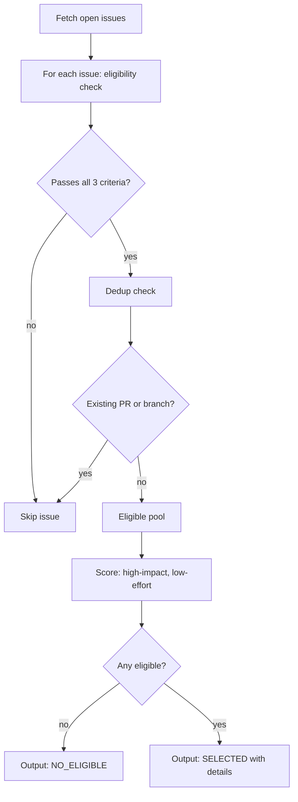

<SUBAGENT-STOP>
You were invoked as a sub-agent by the `openspec-auto` orchestrator. Do not invoke this skill recursively. Follow these instructions directly.
</SUBAGENT-STOP>

# openspec-auto-triage

Evaluate open GitHub issues and return the best candidate for autonomous implementation.

**Model**: haiku (mechanical fetch + filter, no judgment required)

## Flow



## Step 1 — Fetch issues

```bash
gh issue list --state open --limit 50 --json number,title,body,labels,comments
```

## Step 2 — Eligibility: three criteria (all must pass)

**Clarity** — Issue has enough information to implement without human follow-up:
- Bug: must include reproduction steps or a description of observed vs expected behavior
- Feature: must describe the desired behavior or outcome

**No open questions** — No unanswered clarification requests:
- If any comment from the author or a maintainer poses a question without a followup answer, mark ineligible

**Bounded scope** — Implementation is self-contained:
- Ineligible if: requires major architectural decisions, cross-cutting rewrites, or new external dependencies needing architectural review

## Step 3 — Dedup check

For each eligible issue, verify no in-flight work exists:

```bash
gh pr list --state open --json number,body,headRefName
```

Skip the issue if:
- Any open PR body matches `#<N>` followed by a non-digit (standard GitHub closing syntax)
- Any remote branch matches `fix/<N>-*` or `feat/<N>-*`

```bash
git ls-remote --heads origin | grep -E 'fix/<N>-|feat/<N>-'
```

## Step 4 — Selection scoring

From eligible, non-deduped issues, select the one with highest impact and lowest estimated effort:

- Prefer bugs with clear reproduction steps over vague feature requests
- Prefer smaller, more targeted changes
- Prefer issues labeled `bug`, `good first issue`, or with clear acceptance criteria

## Output contract

Output MUST begin with one of these status lines:

**When an issue is selected:**

```
**Status:** SELECTED

Selected issue #<N>: <title>
Branch prefix: `fix` or `feat`
Branch slug: `<3-5-word-kebab-slug-from-title>`

<brief rationale — why this issue, why eligible>
```

**When no eligible issue exists:**

```
**Status:** NO_ELIGIBLE

<brief explanation — what was checked, why nothing passed>
```

**When GitHub API is unavailable (auth error, rate limit):**

```
**Status:** NEEDS_CONTEXT

<description of the error — which command failed and why>
```

The orchestrator reads `SELECTED`, `NO_ELIGIBLE`, or `NEEDS_CONTEXT` from the status line. On `SELECTED`, it reads the issue number, branch prefix, and branch slug from the prose.

## Integration

| Dependency | Purpose |
|------------|---------|
| `gh` CLI | Fetch issues, PRs, and remote branches |
