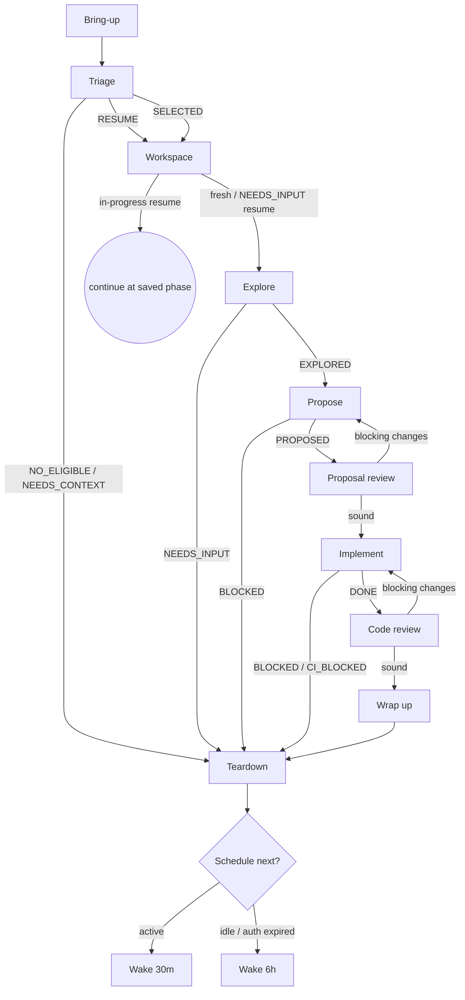

# openspec-auto

Resolve one GitHub issue end-to-end, autonomously, with a full OpenSpec paper trail: triage an issue, gather requirements, propose a change, implement it test-first, review it, and hand a ready PR to a human.

**Why an orchestrator + sub-agents:** Each expensive stage runs as a fresh sub-agent with its own context window. You — the orchestrator — hold only the state machine and the result each sub-agent returns. Sub-agents never inherit your history; you build their context from a prompt template. This prevents the instruction drift that breaks long single-context runs.

**Core principle:** One issue per invocation, and the loop carries no state between runs. **The PR is the durable record:** its `<!-- agent-state: … -->` marker is how the next run discovers in-flight work, the status block + latest summary (discovery output, then a post-proposal summary, then a post-implementation summary) show where things stand, and the comments hold the dialogue (blocking questions and the human's answers). `state.json` is only a within-run cache — created when a workspace is set up, mirrored to the PR marker at each transition, and torn down at the end of the run. **Only the orchestrator writes to the PR** — sub-agents return their output and the orchestrator updates the description and posts comments. Each stage writes its phase, then branches on the sub-agent's `**Status:**` line.

**Continuous execution:** Don't check in with your human between stages. Run the whole machine. Stop only on the terminal conditions in **Stopping Conditions** — otherwise keep going.

## The Process



Stage names match the `phase` they write to `state.json`: **Workspace → `WORKSPACE`**, **Explore → `EXPLORE`**, **Propose → `PROPOSE`**, **Proposal review → `PROPOSAL_REVIEW`**, **Implement → `IMPLEMENT`**, **Code review → `CODE_REVIEW`**, **Wrap up → `IN_REVIEW`** (handed to the human — terminal for the agent). The failure exits write `NEEDS_INPUT` or `CI_BLOCKED`. Phases use `_`, never `-`. Bring-up, Triage, and Teardown run before or after the PR exists and write no phase.

## Model Selection

Dispatch each sub-agent with the lightest model that fits the work:

| Sub-agent | Model | Why |
|-----------|-------|-----|
| triage    | fast/light | Mechanical fetch + filter, no design judgment |
| explore   | capable | Codebase reading and requirement judgment |
| propose   | capable | Structures the discovery into OpenSpec artifacts |
| proposal-review | most capable | Independent judgment on whether the proposal is sound |
| implement | capable | Integration work, coordinates the change |
| code-review | most capable | Design judgment and scope/severity calls — highest stakes |

## Handling Sub-Agent Status

Every sub-agent returns a `**Status:**` line. Branch on it. An unrecognized status means the stage failed — go to Teardown.

| Sub-agent | Status | Action |
|-----------|--------|--------|
| triage    | `RESUME` | Read PR # and recorded phase → **Workspace** (resume), continue at that phase |
| triage    | `SELECTED` | Read issue #, branch prefix, slug from prose → **Workspace** (fresh) |
| triage    | `NO_ELIGIBLE` | Teardown, wake in 6h (idle) |
| triage    | `NEEDS_CONTEXT` | GitHub unreachable / auth expired — Teardown, wake in 6h (loop-blocked) |
| explore   | `EXPLORED` | Write discovery to the PR description → **Propose** |
| explore   | `NEEDS_INPUT` | Write discovery to the PR description, post blocking questions as a PR comment, write `NEEDS_INPUT` + `blocked:true`, Teardown, wake in 30m (active) |
| propose   | `PROPOSED` | Record the `changeName` from the sub-agent's output; write the proposal summary to the PR description → **Proposal review** |
| propose   | `BLOCKED` | Write `blocked:true`, Teardown, wake in 30m (active) |
| proposal-review | `APPROVED` | → **Implement** |
| proposal-review | `CHANGES_REQUESTED` | Run the **review cycle** (assess severity) against Propose |
| implement | `DONE` | Write the implementation summary to the PR description → **Code review** |
| implement | `BLOCKED` | Write `blocked:true`, Teardown, wake in 30m (active) |
| implement | `CI_BLOCKED` | Write `CI_BLOCKED` + `blocked:true`, post the summary comment, Teardown, wake in 30m (active) |
| code-review | `APPROVED` | → **Wrap up** |
| code-review | `CHANGES_REQUESTED` | Run the **review cycle** (assess severity) against Implement |

## Review cycles

Reviews are stateless — `proposal-review` and `code-review` read the current state, judge it, and return findings; they never change anything. The orchestrator owns the loop. When a review returns `CHANGES_REQUESTED`, **you assess the findings by severity**:

- **Blocking findings** → rerun the matching implementation loop (`propose` for proposal-review, `implement` for code-review), passing the blocking findings as its `{{CHANGE_REQUEST}}`. Reset `ciFixes` to 0 before an Implement rerun. Then re-review.
- **Minor, out-of-scope, or unclear findings only** → don't rerun. Post them to the PR as open questions (a comment) and proceed to the next stage. This is what keeps the loop from spinning on improvements that aren't required.

**Don't loop forever.** Count consecutive reruns driven by *blocking* findings. After the **third** such round on the same review, the loop is stuck: post a PR comment summarizing the unresolved findings and asking for input, write `NEEDS_INPUT` + `blocked:true`, and park (Teardown). Never proceed to the next stage with unresolved blocking findings.

## The Stages

Each stage writes its phase to `state.json` and syncs it to the PR, then does its work. Sub-agent stages are dispatched with the `Agent` tool, the matching prompt template, and the model from **Model Selection**.

**Bring-up.** Read `.openspec-auto.json` (reviewer, default branch). If it's missing or invalid, stop and tell the user to run init. That's all — the loop reads no local state across runs; in-flight work is discovered by Triage from the open PRs.

**Triage.** Dispatch the triage sub-agent (`prompts/triage.md`). It builds an issue-keyed table (most-recently-updated first), joining each issue to its associated agent PR, and returns the single best next action: `RESUME` (the most-advanced in-flight PR, with its recorded phase), `SELECTED` (a new issue, with branch prefix + slug), `NO_ELIGIBLE`, or `NEEDS_CONTEXT`. Resumable work takes precedence over new issues.

**Workspace.** Ensure an isolated worktree exists for this issue's branch.
- **Fresh** (from `SELECTED`): assemble the branch as `<prefix>/<issue>-<slug>` and run `setup-workspace.ts <issue> <branch> "<prefix>: <issue title>"` — it checks out the repo's default branch (from `.openspec-auto.json`), creates the branch, anchors an empty commit, opens the draft PR (titled per Conventional Commits), and writes the initial `state.json`. Enter the worktree with `superpowers:using-git-worktrees`, then fetch the issue body and comments (`gh issue view <N> --json body,comments`) to hand to Explore.
- **Resume** (from `RESUME`): the branch and PR already exist — do **not** recreate them. Reconstruct `state.json` from the PR's agent-state marker, fetch and check out the existing branch, enter its worktree with `superpowers:using-git-worktrees`, then continue at the recorded phase: Explore for `WORKSPACE`/`EXPLORE`/answered `NEEDS_INPUT`; Propose for `PROPOSE`; Proposal review for `PROPOSAL_REVIEW`; Implement for `IMPLEMENT`; Code review for `CODE_REVIEW`. (`IN_REVIEW` is terminal — it is never resumed; see **Wrap up**.)

**Explore.** Dispatch the explore sub-agent (`prompts/explore.md`) with the issue body and comments inline; on a resume, also fill `{{PR_CONTEXT}}` with the PR description (prior discovery) and all PR comments. On return, write the discovery output into the PR description with `write-discovery.ts`. Then: `EXPLORED` → proceed to Propose; `NEEDS_INPUT` → post the blocking questions as a PR comment, write `NEEDS_INPUT` + `blocked:true`, and park (Teardown). `changeName` is still empty here — the change doesn't exist yet; **Propose** creates it and reports the name back, which you then record and pass to every stage from there on (`openspec/changes/<changeName>/`).

**Propose.** Dispatch the propose sub-agent (`prompts/propose.md`) with the issue ref, PR number, the **suggested change name** (the branch slug, so change and branch stay paired), and the discovery output. On the first run it creates the change with `opsx:propose`; on a rerun it edits the existing change. It commits and pushes the artifacts and returns the **actual `changeName`** in its `PROPOSED` output. On `PROPOSED`: **record that `changeName` in `state.json`** (the orchestrator owns it), then write the summary into the PR description with `write-discovery.ts` (overwriting the discovery — the description now reflects the post-proposal understanding) → **Proposal review**. `BLOCKED` → Teardown.

**Proposal review.** Write phase `PROPOSAL_REVIEW` to `state.json`, sync to PR. Dispatch the proposal-review sub-agent (`prompts/proposal-review.md`) with the issue ref, PR, and `changeName` for an independent, fresh-context check. Handle its verdict per **Review cycles** (`APPROVED`/minor → Implement; blocking → rerun Propose).

**Implement.** Reset `ciFixes` to 0, then dispatch the implement sub-agent (`prompts/implement.md`) with `changeName`, PR, and branch (on a rerun, code-review's blocking findings as `{{CHANGE_REQUEST}}`). The implement sub-agent is the one sub-agent that writes `state.json` itself — it bumps `ciFixes` as it fixes CI, purely for crash recovery within the run. On `DONE`: write its implementation summary into the PR description with `write-discovery.ts` (overwriting the proposal summary — the description now reflects what was built), then → Code review. `BLOCKED`/`CI_BLOCKED` → Teardown.

**Code review.** Mark the PR ready (`gh pr ready`), then dispatch the code-review sub-agent (`prompts/code-review.md`) with the PR and `changeName` (the spec is its basis — no issue needed). It judges the current diff and returns findings — it changes nothing. Handle its verdict per **Review cycles** (`APPROVED`/minor → Wrap up; blocking → rerun Implement).

**Wrap up.** Set phase `IN_REVIEW` — the agent's work is done and the PR now awaits human review (it is *not* merged; the loop never merges). Invoke `superpowers:finishing-a-development-branch`, then `opsx:archive`, then assign the reviewer (`gh pr edit --add-reviewer <reviewer>`). **This is terminal for the agent — it does not respond to review.** A human merge resolves the issue. If the human instead wants a different solution, they **close the PR** (which abandons it — `survey.ts` ignores closed PRs) and comment on the issue; the next run then sees an open issue with no live agent PR and picks it up fresh, with that comment in the explore/propose context. Archiving the change here is safe precisely because the agent never reopens this work — there is no later Implement that would need the live change directory.

**Teardown — always runs.** Return to the primary checkout and remove the worktree (`git worktree remove --force <path>` — this clears the run's scratch `.openspec-auto/` with it; the PR marker is the durable record). Check out the default branch, pull, then schedule per **Stopping Conditions**.

## Stopping Conditions

After Teardown, **always** schedule the next wakeup with `ScheduleWakeup`. The loop never stops on its own — only a user interrupt halts it. A parked issue stops *that issue*, not the loop: the next run still re-triages and can serve other work.

- **Active** — the iteration did work or parked an issue (handed to review, `NEEDS_INPUT`, or `CI_BLOCKED`) → wake in **30 minutes**. The next run re-triages: it resumes answered `NEEDS_INPUT` work or picks a new issue.
- **Idle / loop-blocked** — nothing to do (no resumable PR, no eligible issue), or `gh` auth has expired / GitHub is unreachable → wake in **6 hours**.

## Prompt Templates

Each sub-agent is defined entirely by its prompt file — there are no separate sub-agent skills. Fill the `{{PLACEHOLDERS}}` and pass the result as the `Agent` prompt:

- `prompts/triage.md`
- `prompts/explore.md`
- `prompts/propose.md`
- `prompts/proposal-review.md`
- `prompts/implement.md`
- `prompts/code-review.md`

## State & Scripts

`state.json` lives in `.openspec-auto/` and is a **within-run cache** — created at Workspace (fresh) or reconstructed from the PR's agent-state marker (resume), and deleted at Teardown. It carries `phase`, `issue`, `prNumber`, `branch`, `changeName`, `ciFixes`, `blocked`. Valid phases: `WORKSPACE`, `EXPLORE`, `NEEDS_INPUT`, `PROPOSE`, `PROPOSAL_REVIEW`, `IMPLEMENT`, `CODE_REVIEW`, `IN_REVIEW`, `CI_BLOCKED`. The durable, cross-run record is the PR's `<!-- agent-state: … -->` marker.

Scripts live in this skill's directory. Set the base once, then call:

```bash
OSL=~/.agents/skills/openspec-auto
$OSL/node_modules/.bin/tsx $OSL/scripts/<name>.ts [args]
```

| Script | Purpose | Example |
|--------|---------|---------|
| `survey.ts` | One-shot GitHub survey → issue table joined to each issue's agent PR + agent-state | `$OSL/node_modules/.bin/tsx $OSL/scripts/survey.ts` |
| `read-state.ts` | Read and validate `state.json` | `$OSL/node_modules/.bin/tsx $OSL/scripts/read-state.ts` |
| `write-state.ts '<json>'` | Write `state.json` (rejects invalid phases) | `$OSL/node_modules/.bin/tsx $OSL/scripts/write-state.ts '{"phase":"WORKSPACE","issue":42,"prNumber":7,"branch":"fix/42-slug","changeName":"fix-slug","ciFixes":0,"blocked":false}'` |
| `sync-pr-state.ts <PR>` | Update the `## Agent Status` block (top of the PR body) in place | `$OSL/node_modules/.bin/tsx $OSL/scripts/sync-pr-state.ts 7` |
| `write-discovery.ts <PR> <file>` | Overwrite the PR body: status block on top, the latest summary (discovery → proposal → implementation) in the middle, the `Closes #N` footer at the bottom (keeps the issue↔PR link alive) | `$OSL/node_modules/.bin/tsx $OSL/scripts/write-discovery.ts 7 discovery.md` |
| `setup-workspace.ts <issue> <branch> <title>` | Branch (off the config default branch) + empty commit + draft PR + initial state | `$OSL/node_modules/.bin/tsx $OSL/scripts/setup-workspace.ts 42 fix/42-slug "fix: auth token expiry"` |

**State update protocol:** on every stage transition, `write-state.ts` first, then `sync-pr-state.ts <PR>`. First-time setup: `cd $OSL && npm install`.

## Red Flags

- **Never read local state across runs** — Bring-up reads only config; Triage discovers in-flight work from open PR markers; `state.json` is recreated each run and deleted at Teardown.
- **Never resume a `CI_BLOCKED` or `IN_REVIEW` PR** — a human owns it. A `NEEDS_INPUT` PR is resumable once the human answers. `IN_REVIEW` is terminal: leave it for the human to merge; if they want something different they close it and the issue is retried fresh.
- **Never recreate the branch/PR on resume** — the worktree was torn down, but the branch and PR persist; re-establish them (Workspace resume mode), don't run `setup-workspace.ts` again.
- **Never skip Teardown** — it runs on every exit, including terminal stops.
- **Never start Code review before Implement returns `DONE`**, or Wrap up before a review's blocking findings are cleared (or judged minor).
- **Never proceed past a review with unresolved blocking findings** — rerun the impl loop; after the third blocking round, post a PR comment for input and park.
- **Never loop on minor findings** — only blocking findings trigger a rerun; minor / out-of-scope / unclear ones become open questions and the loop proceeds.
- **Never let a review change anything** — `proposal-review` and `code-review` judge the current state only; reruns of `propose` / `implement` apply the fixes.
- **Never end a run without scheduling the next wakeup** — the loop never stops on its own. A parked `NEEDS_INPUT`/`CI_BLOCKED` issue parks only that issue; the loop still wakes (30m) to serve others. Only a user interrupt halts it.
- **Never let a sub-agent read your context** — pass everything through its prompt template.
- **Never let a sub-agent edit the PR** — only the orchestrator writes the description and posts comments; sub-agents return their output and you write it.
- **Never carry `ciFixes` across increments** — reset it to 0 before each Implement run.

## Integration

The sub-agents are prompt files (see **Prompt Templates**), not skills. The skills the loop leverages:

| Skill | Stage | Invoked by |
|-------|-------|-----------|
| `superpowers:using-git-worktrees` | Workspace | orchestrator |
| `opsx:explore` | Explore | explore sub-agent |
| `opsx:propose` | Propose | propose sub-agent |
| `opsx:apply` | Implement | implement sub-agent |
| `superpowers:subagent-driven-development` | Implement | implement sub-agent (a sub-agent per task — the one sanctioned nesting) |
| `superpowers:test-driven-development` | Implement | per-task sub-agent |
| `superpowers:requesting-code-review` | Code review | code-review sub-agent |
| `superpowers:finishing-a-development-branch` | Wrap up | orchestrator |
| `opsx:archive` | Wrap up | orchestrator |
