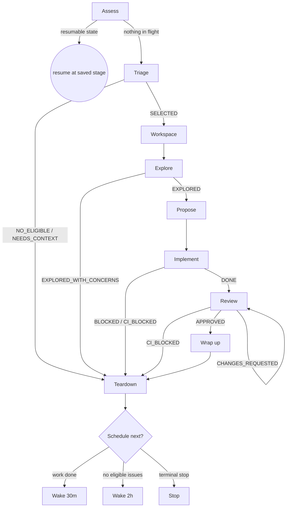

# openspec-auto

Resolve one GitHub issue end-to-end, autonomously, with a full OpenSpec paper trail: triage an issue, gather requirements, propose a change, implement it test-first, review it, and hand a ready PR to a human.

**Why an orchestrator + sub-agents:** Each expensive stage runs as a fresh sub-agent with its own context window. You — the orchestrator — hold only the state machine and the result each sub-agent returns. Sub-agents never inherit your history; you build their context from a prompt template. This prevents the instruction drift that breaks long single-context runs.

**Core principle:** One issue per invocation. `state.json` is the source of truth; the PR description is the human-visible checkpoint. Each stage writes its phase, then branches on the sub-agent's `**Status:**` line.

**Continuous execution:** Don't check in with your human between stages. Run the whole machine. Stop only on the terminal conditions in **Stopping Conditions** — otherwise keep going.

## The Process



Stage names match the `phase` they write to `state.json`: **Workspace → `WORKSPACE`**, **Explore → `EXPLORE`**, **Propose → `PROPOSE`**, **Implement → `IMPLEMENT`**, **Review → `REVIEW`**, **Wrap up → `COMPLETE`**. The failure exits write `NEEDS-INPUT` or `CI-BLOCKED`. Assess, Triage, and Teardown run before or after the PR exists and write no phase.

## Model Selection

Dispatch each sub-agent with the cheapest model that fits the work:

| Sub-agent | Model | Why |
|-----------|-------|-----|
| triage    | haiku  | Mechanical fetch + filter, no design judgment |
| explore   | sonnet | Codebase reading and requirement judgment |
| implement | sonnet | Integration work, coordinates the change |
| review    | opus   | Design judgment and scope calls — highest stakes |

## Handling Sub-Agent Status

Every sub-agent returns a `**Status:**` line. Branch on it. An unrecognized status means the stage failed — go to Teardown.

| Sub-agent | Status | Action |
|-----------|--------|--------|
| triage    | `SELECTED` | Read issue #, branch prefix, slug from prose → **Workspace** |
| triage    | `NO_ELIGIBLE` | Teardown, wake in 2h |
| triage    | `NEEDS_CONTEXT` | GitHub unreachable — print the error, stop, no wakeup |
| explore   | `EXPLORED` | → **Propose** |
| explore   | `EXPLORED_WITH_CONCERNS` | Post the blocking questions to the PR, write `NEEDS-INPUT` + `blocked:true`, Teardown, no wakeup |
| implement | `DONE` | → **Review** |
| implement | `BLOCKED` | Write `blocked:true`, Teardown, no wakeup |
| implement | `CI_BLOCKED` | Write `CI-BLOCKED` + `blocked:true`, Teardown, no wakeup |
| review    | `APPROVED` | → **Wrap up** |
| review    | `CHANGES_REQUESTED` | Sub-agent already pushed fixes; confirm CI green, re-dispatch review once |
| review    | `CI_BLOCKED` | Write `CI-BLOCKED` + `blocked:true`, Teardown, no wakeup |

## The Stages

Each stage writes its phase to `state.json` and syncs it to the PR, then does its work. Sub-agent stages are dispatched with the `Agent` tool, the matching prompt template, and the model from **Model Selection**.

**Assess.** Read config; if `.openspec-auto.json` is missing, stop and tell the user to run init. Read `state.json`: if it exists with `blocked:false` and a phase other than `COMPLETE`, resume that stage. If `blocked:true` or `COMPLETE`, discard it and triage fresh. If there's no local state, scan open PRs for an `<!-- agent-state: … -->` marker (crash recovery), reconstruct the file, and resume; otherwise triage.

**Triage.** Dispatch the triage sub-agent (`prompts/triage.md`). It picks one eligible issue.

**Workspace.** Run `setup-workspace.ts` — it checks out main, creates the `<prefix>/<issue>-<slug>` branch, anchors an empty commit, opens the draft PR, and writes the initial `state.json`. Then enter an isolated workspace with `superpowers:using-git-worktrees`.

**Explore.** Dispatch the explore sub-agent (`prompts/explore.md`) with the issue body and comments inline.

**Propose.** Invoke `opsx:propose` to generate the proposal, specs, design, and tasks. Commit the artifacts, record the `changeName`, then spawn a brief Agent to confirm the tasks are clear and implementable; fix the artifacts if it flags gaps.

**Implement.** Dispatch the implement sub-agent (`prompts/implement.md`).

**Review.** Reset `ciFixes` to 0, mark the PR ready (`gh pr ready`), then dispatch the review sub-agent (`prompts/review.md`).

**Wrap up.** Invoke `superpowers:finishing-a-development-branch`, then `opsx:archive`, then assign the reviewer (`gh pr edit --add-reviewer <reviewer>`).

**Teardown — always runs.** `ExitWorktree({ action: "keep" })`, check out main, pull, then schedule per **Stopping Conditions**.

## Stopping Conditions

After Teardown, schedule the next wakeup with `ScheduleWakeup` — unless a terminal stop applies, in which case print why and schedule nothing.

- **Work completed** (success, NEEDS-INPUT, or CI-BLOCKED) → wake in 30 minutes.
- **No eligible issues** → wake in 2 hours.
- **Terminal stops — no wakeup:** every open issue is in-flight or ineligible; `gh` auth expired (any `gh` command returned an auth error); `NEEDS-INPUT` entered; `CI-BLOCKED` entered.

## Prompt Templates

Each sub-agent is defined entirely by its prompt file — there are no separate sub-agent skills. Fill the `{{PLACEHOLDERS}}` and pass the result as the `Agent` prompt:

- `prompts/triage.md`
- `prompts/explore.md`
- `prompts/implement.md`
- `prompts/review.md`

## State & Scripts

`state.json` lives in `.openspec-auto/` and carries `phase`, `issue`, `prNumber`, `branch`, `changeName`, `ciFixes`, `blocked`. Valid phases: `WORKSPACE`, `EXPLORE`, `NEEDS-INPUT`, `PROPOSE`, `IMPLEMENT`, `REVIEW`, `COMPLETE`, `CI-BLOCKED`.

Scripts live in this skill's directory. Set the base once, then call:

```bash
OSL=~/.claude/skills/openspec-auto
$OSL/node_modules/.bin/tsx $OSL/scripts/<name>.ts [args]
```

| Script | Purpose |
|--------|---------|
| `read-state.ts` | Read and validate `state.json` |
| `write-state.ts '<json>'` | Write `state.json` (rejects invalid phases) |
| `sync-pr-state.ts <PR>` | Render the `## Agent Status` table + marker into the PR body |
| `setup-workspace.ts <issue> <branch> <title>` | Branch + empty commit + draft PR + initial state |

**State update protocol:** on every stage transition, `write-state.ts` first, then `sync-pr-state.ts <PR>`. First-time setup: `cd $OSL && npm install`.

## Red Flags

- **Never resume a `blocked:true` or `COMPLETE` issue** — triage a fresh one.
- **Never skip Teardown** — it runs on every exit, including terminal stops.
- **Never start Review before Implement returns `DONE`**, or Wrap up before Review returns `APPROVED`.
- **Never schedule a wakeup on a terminal stop** — NEEDS-INPUT and CI-BLOCKED wait for a human.
- **Never let a sub-agent read your context** — pass everything through its prompt template.
- **Never carry `ciFixes` across stages** — it resets to 0 when Review begins.

## Integration

The sub-agents are prompt files (see **Prompt Templates**), not skills. The skills the loop leverages:

| Skill | Stage | Invoked by |
|-------|-------|-----------|
| `superpowers:using-git-worktrees` | Workspace | orchestrator |
| `opsx:propose` | Propose | orchestrator |
| `opsx:apply` | Implement | implement sub-agent |
| `superpowers:test-driven-development` | Implement | `opsx:apply` |
| `superpowers:requesting-code-review` | Review | review sub-agent |
| `superpowers:finishing-a-development-branch` | Wrap up | orchestrator |
| `opsx:archive` | Wrap up | orchestrator |
