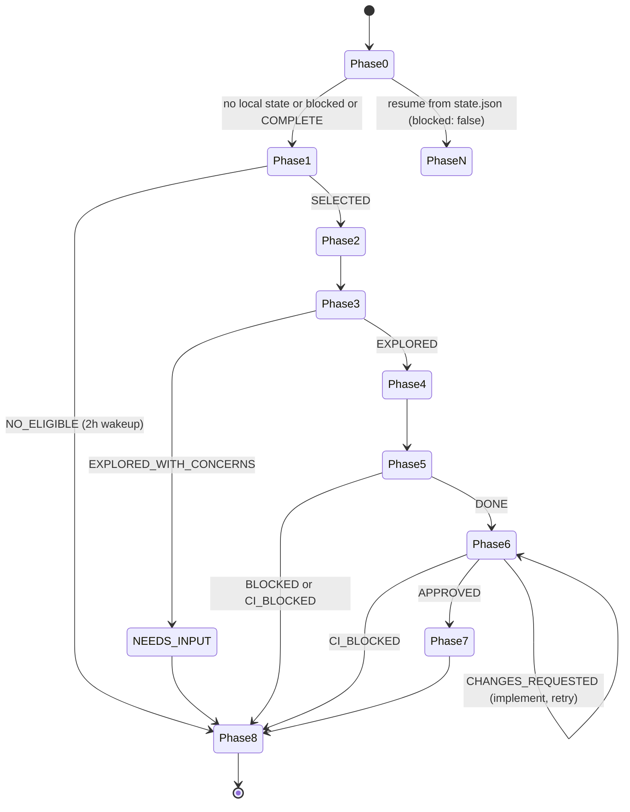

<SUBAGENT-STOP>
This skill manages the orchestrator loop. If you were dispatched as a sub-agent for a specific sub-task (triage, explore, implement, review), stop here — you have your own skill file. This skill is for the main orchestrator only.
</SUBAGENT-STOP>

# openspec-loop

## Script convention

Scripts live inside this skill's directory. Set `OSL` before any script call:

```bash
OSL=~/.claude/skills/openspec-loop
```

Then invoke scripts as:
```bash
$OSL/node_modules/.bin/tsx $OSL/scripts/<name>.ts [args]
```

First-time setup (run once after cloning):
```bash
OSL=~/.claude/skills/openspec-loop && cd $OSL && npm install
```

Autonomous GitHub issue lifecycle agent. On each invocation, resolve one issue end-to-end: triage → explore → propose → implement → review → wrap-up.

## State machine



---

## Phase 0 — Assess State

**Check config first:**
```bash
cat .openspec-loop.json
```
If absent or invalid, stop:
> Config not found. Run `OSL=~/.claude/skills/openspec-loop && $OSL/node_modules/.bin/tsx $OSL/scripts/init.ts` to set up.

**Read local state:**
```bash
OSL=~/.claude/skills/openspec-loop && $OSL/node_modules/.bin/tsx $OSL/scripts/read-state.ts
```

- If state.json exists and `blocked: false` and phase is not `COMPLETE` → resume from that phase (jump to Phase N)
- If state.json exists and `blocked: true` → clear state, proceed to Phase 1
- If state.json exists and `phase: "COMPLETE"` → clear state, proceed to Phase 1
- If state.json is absent → crash recovery: scan GitHub PRs

**Crash recovery (state.json absent):**
```bash
gh pr list --state open --json number,body --limit 100
```
Scan each PR body for `<!-- agent-state: {...} -->`. Parse the JSON. If found and `blocked: false` and phase is not `COMPLETE`, write that state back to `state.json` and resume.

If no resumable PR found → proceed to Phase 1.

---

## Phase 1 — Triage

Invoke the triage sub-agent:

```js
Agent({
  description: "Issue triage",
  prompt: `You are the openspec-loop-triage sub-agent. Invoke your skill at skill/openspec-loop-triage/SKILL.md and select the best issue to implement in the repository at <repo-path>.`,
  subagent_type: "claude"
})
```

Parse the result:
- `**Status:** SELECTED` → read issue number, branch prefix, slug from prose → proceed to Phase 2
- `**Status:** NO_ELIGIBLE` → proceed to Phase 8 with 2-hour wakeup
- No recognizable status → treat as failed, proceed to Phase 8

---

## Phase 2 — Workspace Setup

```bash
git checkout main && git pull origin main
```

Branch name: `<prefix>/<issue>-<slug>` (e.g., `fix/42-missing-null-check`)

```bash
git checkout -b <branch>
```

Use the `superpowers:using-git-worktrees` skill via the `Skill` tool to set up an isolated worktree.

Create an empty commit to anchor the PR:
```bash
git commit --allow-empty -m "chore: open work on issue #<N>"
git push -u origin <branch>
```

Create draft PR:
```bash
gh pr create --draft --title "fix: <issue title>" --body "Closes #<N>" --base main
```

Read the PR number from the output.

Initialize state.json:
```bash
OSL=~/.claude/skills/openspec-loop && $OSL/node_modules/.bin/tsx $OSL/scripts/write-state.ts '{"phase":"WORKSPACE","issue":<N>,"prNumber":<PR>,"branch":"<branch>","changeName":"","ciFixes":0,"blocked":false}'
```

Sync state to PR:
```bash
OSL=~/.claude/skills/openspec-loop && $OSL/node_modules/.bin/tsx $OSL/scripts/sync-pr-state.ts <PR>
```

---

## Phase 3 — Explore

Update state: `phase: "EXPLORE"`. Sync to PR.

Invoke the explore sub-agent:

```js
Agent({
  description: "Requirements gathering",
  prompt: `You are the openspec-loop-explore sub-agent. Invoke your skill at skill/openspec-loop-explore/SKILL.md.

Issue #<N>: <title>
<issue body>
<issue comments>

Working directory: <repo-path>`,
  subagent_type: "claude"
})
```

Parse the result:
- `**Status:** EXPLORED` → proceed to Phase 4
- `**Status:** EXPLORED_WITH_CONCERNS` → read blocking questions from prose, post to PR, enter NEEDS-INPUT:
  ```bash
  gh pr comment <PR> --body "## Blocking Questions\n\n<questions>"
  ```
  Update state: `phase: "NEEDS-INPUT"`, `blocked: true`. Sync to PR. → Phase 8 (no wakeup)
- No recognizable status → treat as failed → Phase 8

---

## Phase 4 — Propose

Update state: `phase: "PROPOSE"`. Sync to PR.

Invoke `opsx:propose` via the `Skill` tool, passing the issue details. This generates the OpenSpec proposal, specs, design, and tasks.

After the skill completes, commit the generated artifacts:
```bash
git add openspec/
git commit -m "chore(openspec): add proposal and artifacts for issue #<N>"
git push
```

Update state: `changeName: "<generated-change-name>"`. Write and sync.

Spawn a lightweight proposal review agent to check the plan makes sense before implementation begins:
```js
Agent({
  description: "Proposal review",
  prompt: `Review the OpenSpec proposal at openspec/changes/<changeName>/proposal.md and tasks at openspec/changes/<changeName>/tasks.md. Check that tasks are clear and implementable. Report any gaps. Keep it brief.`,
  subagent_type: "claude"
})
```

If the review surfaces issues, update the artifacts before proceeding.

---

## Phase 5 — Implement

Update state: `phase: "IMPLEMENT"`. Sync to PR.

Invoke the implement sub-agent:

```js
Agent({
  description: "Implementation",
  prompt: `You are the openspec-loop-implement sub-agent. Invoke your skill at skill/openspec-loop-implement/SKILL.md.

PR: #<PR>
Branch: <branch>
Issue: #<N>
Change name: <changeName>
Working directory: <repo-path>

Tasks:
<tasks.md contents>`,
  subagent_type: "claude"
})
```

Parse the result:
- `**Status:** DONE` → proceed to Phase 6
- `**Status:** BLOCKED` → update state: `blocked: true`. Sync. → Phase 8
- `**Status:** CI_BLOCKED` → update state: `phase: "CI-BLOCKED"`, `blocked: true`. Sync. → Phase 8
- No recognizable status → treat as failed → Phase 8

---

## Phase 6 — Review

Reset CI fixes: update state `ciFixes: 0`. Sync to PR.

Mark PR ready:
```bash
gh pr ready <PR>
```

Invoke the review sub-agent:

```js
Agent({
  description: "Code review",
  prompt: `You are the openspec-loop-review sub-agent. Invoke your skill at skill/openspec-loop-review/SKILL.md.

PR: #<PR>
Working directory: <repo-path>`,
  subagent_type: "claude"
})
```

Parse the result:
- `**Status:** APPROVED` → proceed to Phase 7
- `**Status:** CHANGES_REQUESTED` → the sub-agent already implemented the changes; check if CI passes, then re-run the review sub-agent once more
- `**Status:** CI_BLOCKED` → update state: `phase: "CI-BLOCKED"`, `blocked: true`. Sync. → Phase 8
- No recognizable status → treat as failed → Phase 8

---

## Phase 7 — Wrap-up

Update state: `phase: "COMPLETE"`. Sync to PR.

Update PR description with a final summary. Review and update OpenSpec artifacts if needed.

Archive the change:
```bash
# Via Skill tool:
Skill({ skill: "opsx:archive" })
```

Assign reviewer:
```bash
gh pr edit <PR> --add-reviewer <reviewer>
```

---

## Phase 8 — Teardown

Always runs, regardless of how the iteration ended.

Exit the worktree:
```js
ExitWorktree({ action: "keep" })
```

Return to main:
```bash
git checkout main && git pull origin main
```

**Schedule next wakeup** (via `ScheduleWakeup`):
- Completed work (success, NEEDS-INPUT, CI-BLOCKED): 30 minutes
- No eligible issues: 2 hours
- NEEDS-INPUT or CI-BLOCKED: **do not schedule** — stop and wait for human

**Stopping conditions — do NOT call ScheduleWakeup when:**
- All issues are in-flight or ineligible
- `gh` authentication has expired (any `gh` command exited with auth error)
- NEEDS-INPUT state was entered
- CI-BLOCKED state was entered

Output a clear message explaining why the loop stopped.

---

## State update protocol

After every phase transition:
1. `OSL=~/.claude/skills/openspec-loop && $OSL/node_modules/.bin/tsx $OSL/scripts/write-state.ts '<json>'`
2. `OSL=~/.claude/skills/openspec-loop && $OSL/node_modules/.bin/tsx $OSL/scripts/sync-pr-state.ts <PR>` (when a PR exists)

Valid phase values: `WORKSPACE`, `EXPLORE`, `NEEDS-INPUT`, `PROPOSE`, `IMPLEMENT`, `REVIEW`, `COMPLETE`, `CI-BLOCKED`

## Sub-agent invocation principle

Pass all needed context inline in the sub-agent's prompt. Sub-agents have no conversation history. The orchestrator constructs exactly what they need — issue body, task list, PR number, repo path — pasted inline.
